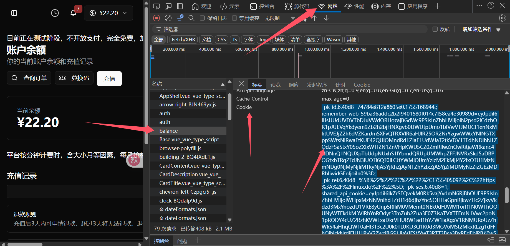

# LeafLow Token Usage Guide

## Introduction

The token-based solution uses authentication information (cookies/tokens) obtained from the browser to achieve automatic check-in, avoiding complex login processes.

## Advantages

- ✅ **Server-Friendly**: No need to install a browser or Chrome
- ✅ **Low Memory Usage**: Uses only HTTP requests, no JavaScript rendering
- ✅ **Stable and Reliable**: Bypasses complex OAuth processes
- ✅ **Easy to Maintain**: Tokens have a long validity period and low update frequency

## Usage Steps

### 1. Obtain Authentication Information

#### Method A: Using Browser Developer Tools (Recommended)

1.  **Open Browser**: Use a modern browser such as Chrome, Firefox, or Edge
2.  **Visit Website**: Navigate to `https://leaflow.net` and log in
3.  **Open Developer Tools**: Press `F12` or right-click and select "Inspect"
4.  **View Network Requests**:
    *   Switch to the `Network` tab
    *   Refresh the page or visit any page that requires login (e.g., user center)
    *   Find the main site request in the request list (e.g., `leaflow.net`)
5.  **Copy Cookies**:
    *   In the `Headers` tab on the right, scroll down to the `Request Headers` section
    *   Find the `cookie` field and copy its entire string value.



### 2. Configure Settings

1.  **Copy Template**:
    ```bash
    cp config.token.template.json config.accounts.json
    ```

2.  **Edit Configuration**:
    ```bash
    nano config.accounts.json  # or use another editor
    ```

3.  **Fill in Authentication Information**:
    ```json
    {
      "settings": {
        "log_level": "INFO",
        "retry_delay": 3,
        "timeout": 30,
        "user_agent": "Mozilla/5.0..."
      },
      "accounts": [
        {
          "token_data": {
            "cookies": {
              "leaflow_session": "your_session_value",
              "remember_web_59ba36addc2b2f9401580f014c7f58ea4e30989d": "your_remember_token_value",
              "XSRF-TOKEN": "your_xsrf_token_value"
            }
          }
        }
      ]
    }
    ```

### 3. Run Check-in Script

```bash
# Basic execution
python3 checkin_token.py

# Debug mode (view detailed logs)
python3 checkin_token.py --debug

# Use custom configuration file
python3 checkin_token.py --config my_config.json

# Enable notifications
python3 checkin_token.py --notify
```
